# Ship Smartly — GitOps, Observability, and Automated Canary Rollout

## 1. Overview

This project implements a safe delivery pipeline for an API service on Kubernetes.

The API is released through Git. Argo CD syncs the desired state from Git into the cluster. Argo Rollouts performs canary deployment. Prometheus measures API quality through application metrics. If the canary is healthy, it continues to 100%. If the canary is unhealthy, the rollout is automatically aborted and the previous stable version continues serving traffic.

The challenge combines three main areas:

| Area                 | Implementation                                                                                       |
| -------------------- | ---------------------------------------------------------------------------------------------------- |
| GitOps               | All changes are committed and pushed to Git. Argo CD syncs Kubernetes resources from the repository. |
| Observability        | Prometheus scrapes API metrics, evaluates an SLO alert, and Alertmanager sends email notification.   |
| Progressive Delivery | Argo Rollouts uses Prometheus analysis to automatically promote or abort canary releases.            |

---

## 2. Architecture

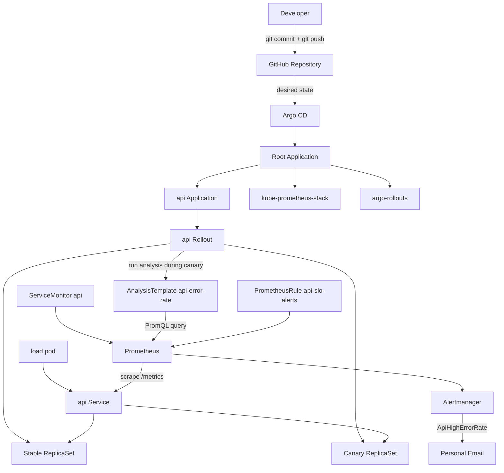

Pipeline flow:

```text
Developer changes api.yaml
  -> git commit + git push
  -> Argo CD syncs api Application
  -> Argo Rollouts creates a canary ReplicaSet
  -> Prometheus checks API error ratio
  -> AnalysisTemplate decides pass or fail
  -> good canary reaches 100%
  -> bad canary is aborted
```

---

## 3. Repository Structure

```text
gitops/
├── argocd/
│   ├── root.yaml
│   └── apps/
│       ├── api.yaml
│       ├── argo-rollouts.yaml
│       ├── kube-prometheus-stack.yaml
│       └── web.yaml
├── app/
│   ├── app.py
│   └── Dockerfile
├── k8s-api/
│   ├── api.yaml
│   ├── analysis-template.yaml
│   ├── prometheus-rule.yaml
│   └── servicemonitor.yaml
└── docs/
    └── images/
        ├── 01-argocd-apps.png
        ├── 02-prometheus-target-api-up.png
        ├── 03-prometheus-rule-loaded.png
        ├── 04-rollback-abord.png
        ├── 05-workload-stable.png
        ├── 06-email-received.png
        ├── 07-rollout-auto-abort.png
        ├── 08-analysisrun-failed.png
        ├── 09-table-vs-bad-env.png
        └── 10-final-healthy.png
```

---

## 4. GitOps Implementation

All changes were made through Git.

The API application is managed by Argo CD. The `api` Argo CD Application points to the `k8s-api/` directory, where the Rollout, Service, ServiceMonitor, PrometheusRule, and AnalysisTemplate are stored.

Command used to verify Argo CD applications:

```bash
kubectl -n argocd get app
```

Evidence:

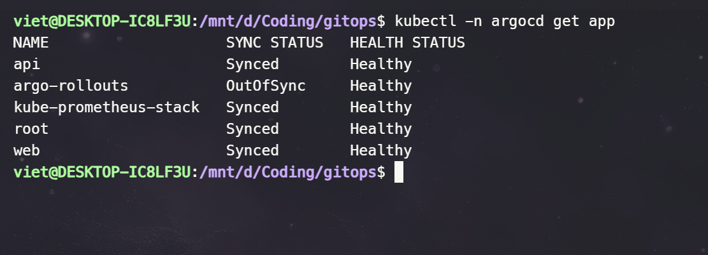

The screenshot shows that Argo CD manages the applications used in this challenge, including:

| Application             | Purpose                                                                            |
| ----------------------- | ---------------------------------------------------------------------------------- |
| `root`                  | App-of-apps parent application                                                     |
| `api`                   | Deploys API Rollout, Service, AnalysisTemplate, ServiceMonitor, and PrometheusRule |
| `kube-prometheus-stack` | Installs Prometheus, Grafana, Alertmanager, Prometheus Operator                    |
| `argo-rollouts`         | Installs Argo Rollouts controller                                                  |

---

## 5. API Application

The API is a Flask application packaged as a Docker image.

Important endpoints:

| Endpoint   | Purpose                          |
| ---------- | -------------------------------- |
| `/`        | Returns API response and version |
| `/healthz` | Readiness probe endpoint         |
| `/metrics` | Prometheus metrics endpoint      |

The API supports two environment variables:

| Variable     | Purpose                         |
| ------------ | ------------------------------- |
| `VERSION`    | Identifies the deployed version |
| `ERROR_RATE` | Injects failures for testing    |

Healthy version example:

```yaml
- name: ERROR_RATE
  value: "0"
- name: VERSION
  value: "v-good-final"
```

Bad version example:

```yaml
- name: ERROR_RATE
  value: "1"
- name: VERSION
  value: "v-bad-auto-abort"
```

`ERROR_RATE=1` means the new version intentionally returns errors. This was used to prove that the canary can be automatically aborted.

---

## 6. Prometheus Metrics Scraping

The API exposes metrics at:

```text
/metrics
```

Prometheus discovers the API through `ServiceMonitor`.

ServiceMonitor configuration:

```yaml
apiVersion: monitoring.coreos.com/v1
kind: ServiceMonitor
metadata:
  name: api
  namespace: monitoring
spec:
  namespaceSelector:
    matchNames:
      - demo
  selector:
    matchLabels:
      app: api
  endpoints:
    - port: http
      path: /metrics
      interval: 15s
```

Command used to open Prometheus:

```bash
kubectl -n monitoring port-forward svc/kube-prometheus-stack-prometheus 9090:9090
```

Prometheus target page:

```text
http://localhost:9090/targets
```

Evidence:

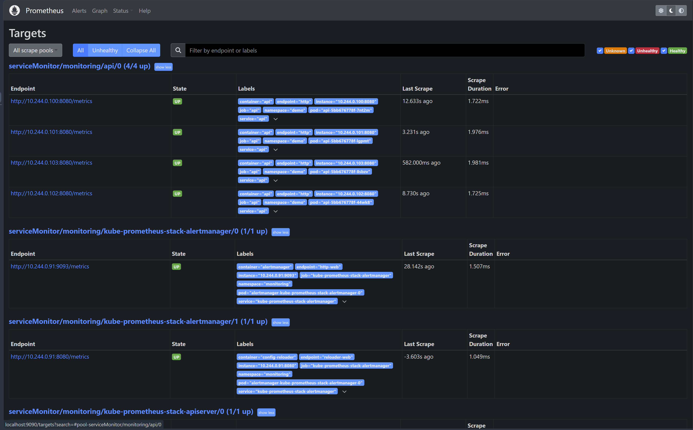

The API target is UP, which means Prometheus successfully scrapes `/metrics` from the API pods.

---

## 7. SLO and Alert Rule

The selected SLO is based on API availability.

In this lab, availability is measured through HTTP 5xx error ratio.

Formula:

```text
error_ratio = 5xx_request_rate / total_request_rate
```

PromQL recording rule:

```promql
(
  sum(rate(flask_http_request_total{namespace="demo",job="api",status=~"5.."}[1m]))
  or vector(0)
)
/
clamp_min(
  (
    sum(rate(flask_http_request_total{namespace="demo",job="api"}[1m]))
    or vector(0)
  ),
  0.001
)
```

Explanation:

| Part                    | Meaning                                            |
| ----------------------- | -------------------------------------------------- |
| `rate(...[1m])`         | Calculates request rate over the last 1 minute     |
| `status=~"5.."`         | Selects HTTP 5xx responses                         |
| `sum(...)`              | Aggregates across all API pods                     |
| `or vector(0)`          | Returns 0 if Prometheus has no matching series yet |
| `clamp_min(..., 0.001)` | Prevents division by zero                          |

The alert rule:

```yaml
- alert: ApiHighErrorRate
  expr: api:request_error_ratio:rate1m > 0.10
  for: 0m
  labels:
    severity: critical
    service: api
    slo: availability
  annotations:
    summary: "API error rate is too high"
    description: "API error rate is above 10%. This violates the API availability SLO."
```

Threshold:

| Error ratio | Result                                   |
| ----------- | ---------------------------------------- |
| `<= 10%`    | Acceptable for this lab                  |
| `> 10%`     | SLO alert fires                          |
| `>= 10%`    | Canary analysis fails and Rollout aborts |

`for: 0m` was used because canary rollback can happen quickly. If the alert waited for 1 minute, the bad canary might already be aborted before the alert became `FIRING`.

Prometheus loaded the rule:

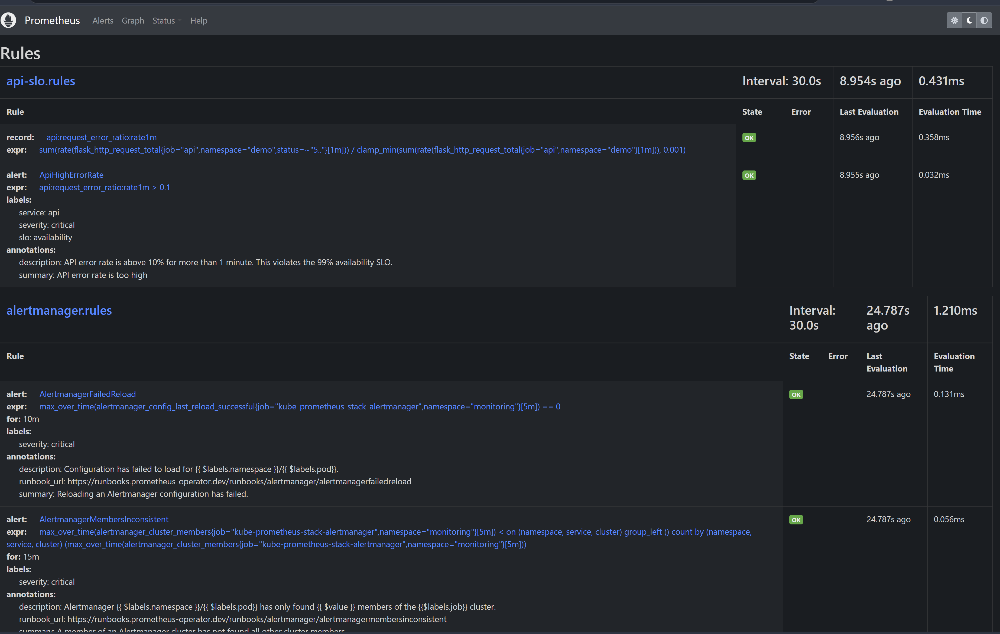

---

## 8. Alertmanager Email Notification

Alertmanager was configured to send only the custom API alert to email.

System alerts were routed to `null` to avoid email spam from minikube-related alerts.

Alertmanager route:

```yaml
route:
  receiver: "null"
  group_by: ["alertname", "service"]
  group_wait: 10s
  group_interval: 30s
  repeat_interval: 5m
  routes:
    - receiver: email-personal
      matchers:
        - alertname="ApiHighErrorRate"

receivers:
  - name: "null"
  - name: email-personal
    email_configs:
      - to: nampno3@gmail.com
        send_resolved: true
```

The Gmail App Password was stored in a Kubernetes Secret and mounted into Alertmanager.

```yaml
smtp_auth_password_file: /etc/alertmanager/secrets/alertmanager-gmail-secret/smtp-auth-password
```

The secret value was not committed to Git.

Email evidence:

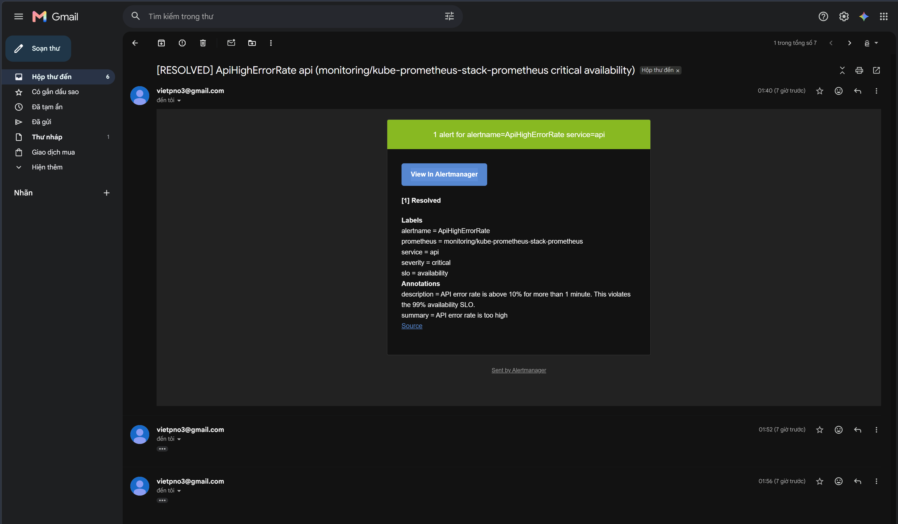

This proves that the SLO alert was successfully delivered to the personal email receiver.

---

## 9. Canary Strategy

The API is deployed as an Argo Rollouts `Rollout`.

The canary strategy:

```yaml
strategy:
  canary:
    steps:
      - setWeight: 25
      - analysis:
          templates:
            - templateName: api-error-rate
      - setWeight: 50
      - analysis:
          templates:
            - templateName: api-error-rate
      - setWeight: 100
```

With 4 replicas:

```text
25% canary = 1 canary pod + 3 stable pods
```

No manual `promote` or `abort` is required. The rollout decision is made by the AnalysisTemplate.

---

## 10. AnalysisTemplate

The AnalysisTemplate queries Prometheus during the canary rollout.

File:

```text
k8s-api/analysis-template.yaml
```

Important configuration:

```yaml
successCondition: result[0] < 0.10
failureCondition: result[0] >= 0.10
interval: 15s
count: 4
failureLimit: 1
```

Decision logic:

| Condition                      | Rollout decision                            |
| ------------------------------ | ------------------------------------------- |
| `result[0] < 0.10`             | Analysis succeeds and rollout continues     |
| `result[0] >= 0.10`            | Analysis fails                              |
| More than 1 failed measurement | AnalysisRun fails because `failureLimit: 1` |
| AnalysisRun fails              | Rollout automatically aborts the canary     |

This removes the previous inconclusive gap between 5% and 10%. The rollout now has a clear result: pass or fail.

---

## 11. Automated Canary Abort Test

A bad version was released through Git:

```yaml
- name: ERROR_RATE
  value: "1"
- name: VERSION
  value: "v-bad-auto-abort"
```

Git commands used:

```bash
git add k8s-api/api.yaml
git commit -m "release bad api for auto abort test"
git push
```

Argo CD synced the change. Argo Rollouts started the canary and ran the Prometheus analysis.

Evidence:

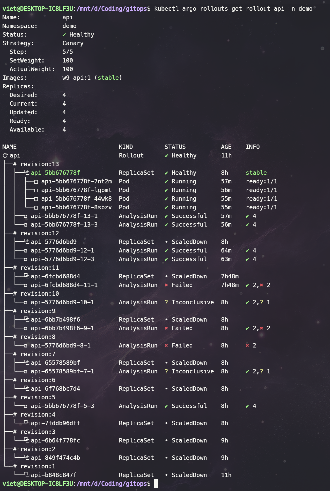

Important output:

```text
RolloutAborted: Rollout aborted update to revision 11
```

The failed canary revision:

```text
revision 11
api-6fcbd688d4        ReplicaSet   ScaledDown   canary
api-6fcbd688d4-11-1   AnalysisRun  Failed
```

The previous stable revision:

```text
revision 5
api-5bb676778f        ReplicaSet   Healthy      stable
4 pods Running
```

This proves that the new bad version did not become stable.

---

## 12. AnalysisRun Failure Evidence

Command used:

```bash
kubectl -n demo describe analysisrun api-6fcbd688d4-11-1
```

Evidence:

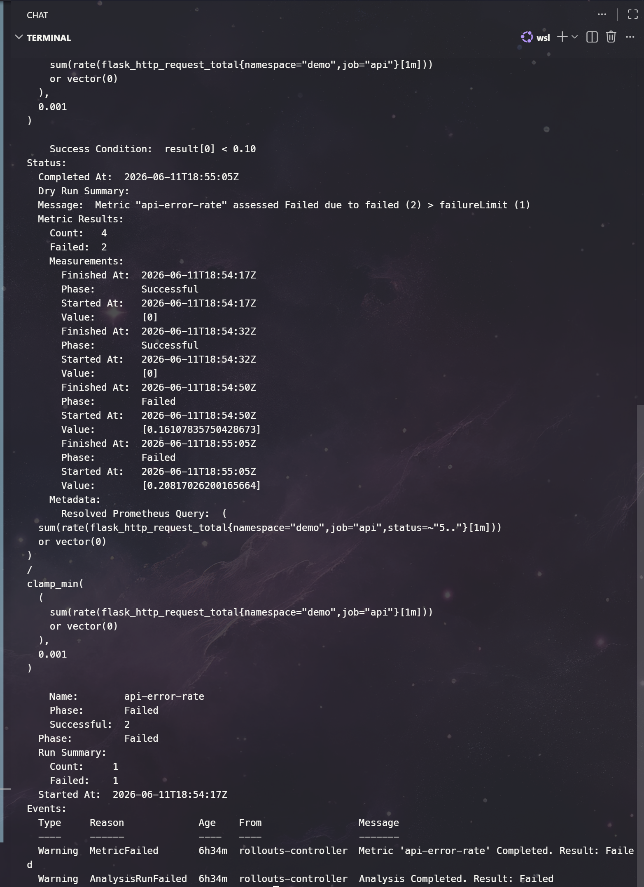

The AnalysisRun failed because the Prometheus value crossed the configured threshold.

The expected reason is:

```text
api-error-rate >= 0.10
```

Since `failureLimit` is set to `1`, the second failed measurement causes the whole AnalysisRun to fail. Argo Rollouts then aborts the canary update.

---

## 13. How Abort Returned to the Old Version

Argo Rollouts does not display a sentence like “rolled back to the old version”. Instead, it shows this through ReplicaSet state.

Bad canary revision:

```text
revision 11
ReplicaSet: api-6fcbd688d4
Status: ScaledDown
Role: canary
```

Previous stable revision:

```text
revision 5
ReplicaSet: api-5bb676778f
Status: Healthy
Role: stable
Pods: 4 Running
```

Evidence:

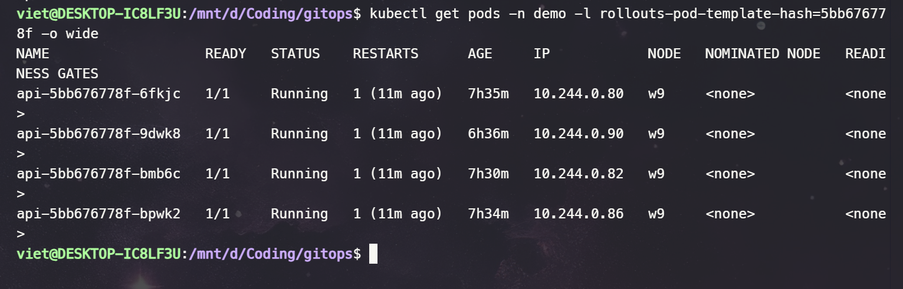

This is the practical rollback behavior: the bad canary is scaled down, while the previous stable ReplicaSet remains active and continues serving traffic.

Environment comparison:

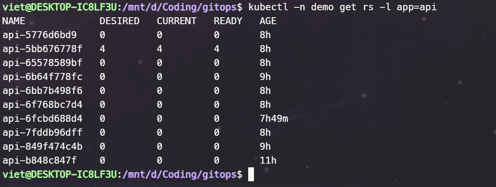

This shows the difference between the stable version and the bad canary version.

---

## 14. Rollback Through Git Revert

The challenge requires rollback through Git in less than 5 minutes.

Rollback was performed with:

```bash
git revert HEAD --no-edit
git push
kubectl -n argocd annotate app api argocd.argoproj.io/refresh=hard --overwrite
```

Evidence:

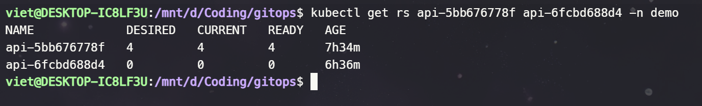

This proves the rollback path is Git-based, not a manual `kubectl edit` or direct manifest apply.

---

## 15. Final Healthy State

After rollback, the final state was checked.

Commands:

```bash
kubectl -n argocd get app api
kubectl argo rollouts get rollout api -n demo
git status
```

Expected final state:

```text
api Synced Healthy
Rollout Healthy
working tree clean
```

Evidence:

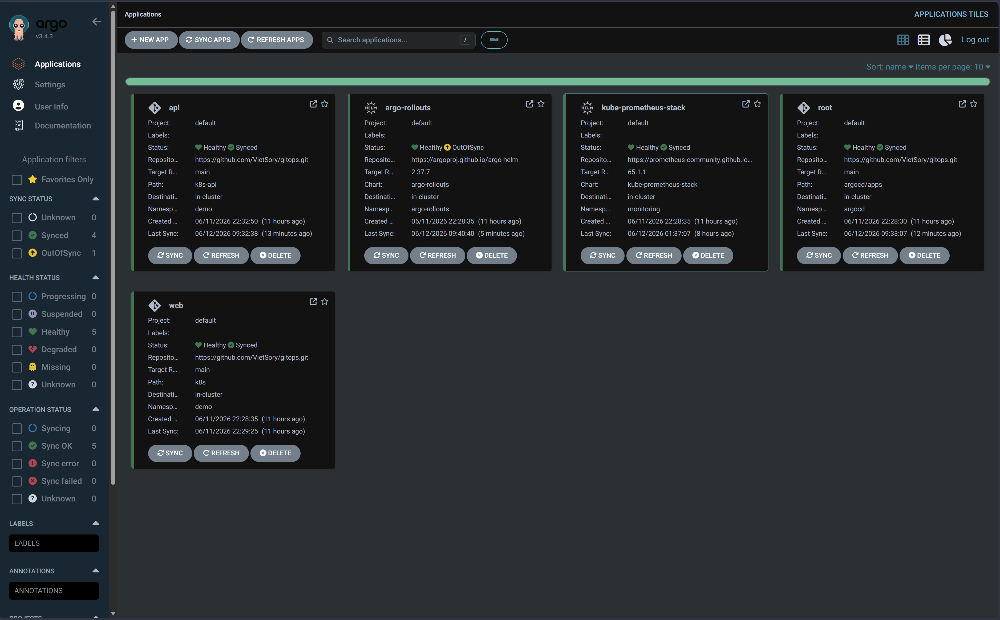

This confirms that the repository and cluster returned to a clean state after rollback.

---

## 16. Result Summary

| Requirement             | Result                                                                 |
| ----------------------- | ---------------------------------------------------------------------- |
| All changes through Git | Completed. API and monitoring changes were committed and pushed.       |
| Argo CD sync            | Completed. Argo CD synced the desired state from Git.                  |
| SLO and alert           | Completed. `ApiHighErrorRate` fired when API error ratio exceeded 10%. |
| Email notification      | Completed. Alertmanager sent the alert to personal email.              |
| Automated canary abort  | Completed. Bad canary revision was aborted automatically.              |
| Rollback                | Completed. Git revert restored the previous good state.                |

Key result:

```text
Bad revision 11
  -> AnalysisRun Failed
  -> canary ReplicaSet ScaledDown

Previous revision 5
  -> stable ReplicaSet Healthy
  -> 4 pods Running
```

The system successfully prevented the bad version from becoming the stable release.
