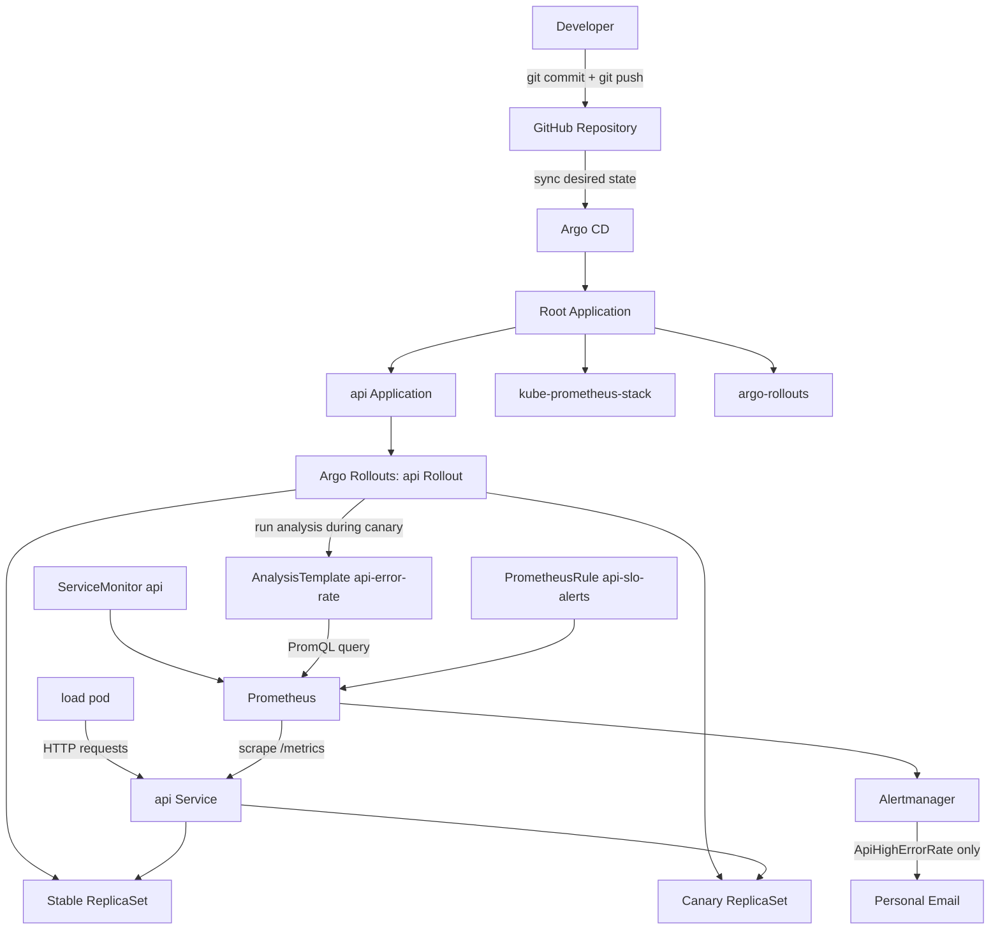

# Ship Smartly — GitOps, Observability, and Automated Canary Rollout

## 1. Goal

This challenge demonstrates a safe delivery pipeline for an API service.

The system releases a new API version through Git, lets Argo CD sync the desired state, uses Argo Rollouts to run a canary deployment, evaluates the canary with Prometheus metrics, and automatically aborts the rollout when the new version is unhealthy.

The final pipeline covers three areas:

| Area                 | Implementation                                                                                                        |
| -------------------- | --------------------------------------------------------------------------------------------------------------------- |
| GitOps               | All changes are committed and pushed to Git. Argo CD syncs the Kubernetes state from the repository.                  |
| Observability        | Prometheus scrapes API metrics, evaluates an SLO alert, and sends notification through Alertmanager email receiver.   |
| Progressive Delivery | Argo Rollouts releases the new version gradually and uses an AnalysisTemplate to decide whether to continue or abort. |

---

## 2. Architecture



### Request flow

```text
load pod
  -> api Service
  -> stable pods + canary pod
  -> Flask API
  -> /metrics exposed by prometheus-flask-exporter
  -> Prometheus scrape
  -> AnalysisTemplate checks error ratio
  -> Rollout continues or aborts
```

---

## 3. Repository Structure

```text
gitops/
├── argocd/
│   ├── root.yaml
│   └── apps/
│       ├── api.yaml
│       ├── argo-rollouts.yaml
│       ├── kube-prometheus-stack.yaml
│       └── web.yaml
├── app/
│   ├── app.py
│   └── Dockerfile
├── k8s-api/
│   ├── api.yaml
│   ├── analysis-template.yaml
│   ├── prometheus-rule.yaml
│   └── servicemonitor.yaml
└── docs/
    └── images/
```

---

## 4. Main Components

### 4.1 Argo CD

Argo CD watches the Git repository and syncs Kubernetes resources from Git into the cluster.

The root application follows the app-of-apps pattern. It reads child applications from:

```text
argocd/apps/
```

The API application points to:

```text
k8s-api/
```

This means the API Rollout, Service, ServiceMonitor, PrometheusRule, and AnalysisTemplate are all managed from Git.

---

### 4.2 Flask API

The API is a simple Flask service with three important endpoints:

| Endpoint   | Purpose                                 |
| ---------- | --------------------------------------- |
| `/`        | Returns JSON response with app version. |
| `/healthz` | Readiness check endpoint.               |
| `/metrics` | Prometheus metrics endpoint.            |

The API uses environment variables:

| Variable     | Meaning                                                                            |
| ------------ | ---------------------------------------------------------------------------------- |
| `VERSION`    | Identifies the deployed version, for example `v-good-final` or `v-bad-auto-abort`. |
| `ERROR_RATE` | Controls injected failure rate. `0` means healthy, `1` means 100% error injection. |

Example healthy version:

```yaml
- name: ERROR_RATE
  value: "0"
- name: VERSION
  value: "v-good-final"
```

Example bad version:

```yaml
- name: ERROR_RATE
  value: "1"
- name: VERSION
  value: "v-bad-auto-abort"
```

---

## 5. Canary Strategy

The API is deployed as an Argo Rollouts `Rollout`, not a standard Kubernetes `Deployment`.

The Rollout strategy is canary-based:

```yaml
strategy:
  canary:
    steps:
      - setWeight: 25
      - analysis:
          templates:
            - templateName: api-error-rate
      - setWeight: 50
      - analysis:
          templates:
            - templateName: api-error-rate
      - setWeight: 100
```

### Canary behavior

| Step             | Meaning                                                                                                                         |
| ---------------- | ------------------------------------------------------------------------------------------------------------------------------- |
| `setWeight: 25`  | Start the new version with approximately 25% canary weight. With 4 replicas, this usually means 1 canary pod and 3 stable pods. |
| `analysis`       | Query Prometheus to check API error rate.                                                                                       |
| `setWeight: 50`  | Continue only if analysis succeeds.                                                                                             |
| `setWeight: 100` | Promote the new version fully if all checks pass.                                                                               |

This challenge does not use manual `promote` or `abort`. The rollout decision is made by Prometheus metrics through the AnalysisTemplate.

---

## 6. AnalysisTemplate

File:

```text
k8s-api/analysis-template.yaml
```

The AnalysisTemplate queries Prometheus during the canary rollout.

```yaml
apiVersion: argoproj.io/v1alpha1
kind: AnalysisTemplate
metadata:
  name: api-error-rate
  namespace: demo
spec:
  metrics:
    - name: api-error-rate
      interval: 15s
      count: 4
      failureLimit: 1
      successCondition: result[0] < 0.10
      failureCondition: result[0] >= 0.10
      provider:
        prometheus:
          address: http://kube-prometheus-stack-prometheus.monitoring.svc:9090
          query: |
            (
              sum(rate(flask_http_request_total{namespace="demo",job="api",status=~"5.."}[1m]))
              or vector(0)
            )
            /
            clamp_min(
              (
                sum(rate(flask_http_request_total{namespace="demo",job="api"}[1m]))
                or vector(0)
              ),
              0.001
            )
```

### Formula

The analysis calculates API error ratio:

```text
error_ratio = 5xx_requests_per_second / total_requests_per_second
```

PromQL:

```promql
(
  sum(rate(flask_http_request_total{namespace="demo",job="api",status=~"5.."}[1m]))
  or vector(0)
)
/
clamp_min(
  (
    sum(rate(flask_http_request_total{namespace="demo",job="api"}[1m]))
    or vector(0)
  ),
  0.001
)
```

### Why `or vector(0)` is used

When Prometheus has no matching time series yet, a query may return an empty result. Argo Rollouts expects `result[0]`. If the query returns nothing, the analysis can fail with an index error.

`or vector(0)` makes the query return `0` instead of an empty result.

### Why `clamp_min(..., 0.001)` is used

The denominator is the total request rate. If there are no requests, the denominator can be `0`.

`clamp_min(..., 0.001)` prevents division by zero.

### Success and failure thresholds

| Condition             | Result                                   |
| --------------------- | ---------------------------------------- |
| `error_ratio < 0.10`  | Analysis succeeds. Rollout can continue. |
| `error_ratio >= 0.10` | Analysis fails. Rollout aborts.          |

The threshold is set to `10%` for lab demonstration. With 4 replicas and 25% canary, a fully broken canary usually creates an error ratio around 25%, which is above the 10% threshold.

### Analysis timing

| Field             | Meaning                                                                               |
| ----------------- | ------------------------------------------------------------------------------------- |
| `interval: 15s`   | Run one Prometheus measurement every 15 seconds.                                      |
| `count: 4`        | Run up to 4 measurements.                                                             |
| `failureLimit: 1` | Allow only 1 failed measurement. The second failed measurement fails the AnalysisRun. |

Therefore, the rollout aborts when the canary causes the error ratio to be greater than or equal to 10% in more than one measurement.

---

## 7. SLO and Alert

File:

```text
k8s-api/prometheus-rule.yaml
```

The challenge requires one SLO and one alert.

### SLO

```text
API Availability SLO: the API should keep a low 5xx error ratio.
```

The practical lab indicator is:

```text
error_ratio_1m <= 10%
```

This lab uses a relaxed threshold to make the alert and auto-abort easy to demonstrate. In a production system, this threshold should be replaced by a stricter SLO or a burn-rate alert.

### Prometheus recording rule

```yaml
- record: api:request_error_ratio:rate1m
  expr: |
    (
      sum(rate(flask_http_request_total{namespace="demo",job="api",status=~"5.."}[1m]))
      or vector(0)
    )
    /
    clamp_min(
      (
        sum(rate(flask_http_request_total{namespace="demo",job="api"}[1m]))
        or vector(0)
      ),
      0.001
    )
```

### Alert rule

```yaml
- alert: ApiHighErrorRate
  expr: api:request_error_ratio:rate1m > 0.10
  for: 0m
  labels:
    severity: critical
    service: api
    slo: availability
  annotations:
    summary: "API error rate is too high"
    description: "API error rate is above 10%. This violates the API availability SLO."
```

The alert fires immediately when the API error ratio is greater than 10%.

`for: 0m` is used for lab verification because the canary can be aborted quickly. Waiting for one minute may cause the canary to disappear before the alert reaches `FIRING`.

---

## 8. Alertmanager Email Routing

Alertmanager is configured to send only the API SLO alert to email.

System alerts are routed to a null receiver to avoid email spam from minikube control-plane alerts.

```yaml
route:
  receiver: "null"
  group_by: ["alertname", "service"]
  group_wait: 10s
  group_interval: 30s
  repeat_interval: 5m
  routes:
    - receiver: email-personal
      matchers:
        - alertname="ApiHighErrorRate"

receivers:
  - name: "null"
  - name: email-personal
    email_configs:
      - to: nampno3@gmail.com
        send_resolved: true
```

The Gmail App Password is stored in a Kubernetes Secret and mounted into Alertmanager.

```yaml
smtp_auth_password_file: /etc/alertmanager/secrets/alertmanager-gmail-secret/smtp-auth-password
```

The secret value is not committed to Git.

---

## 9. Verification Evidence

### 9.1 Argo CD Applications

Evidence:

```bash
kubectl -n argocd get app
```

Expected result:

```text
root                    Synced   Healthy
kube-prometheus-stack   Synced   Healthy
argo-rollouts           Healthy
api                     Synced   Healthy
```

Screenshot:

```text
docs/images/01-argocd-apps.png
```

---

### 9.2 Good Canary Release

A healthy release uses:

```yaml
ERROR_RATE: "0"
VERSION: "v-good-final"
```

Evidence:

```bash
kubectl argo rollouts get rollout api -n demo
```

Expected result:

```text
AnalysisRun Successful
Rollout Healthy
Stable ReplicaSet has 4 Running pods
```

Screenshot:

```text
docs/images/02-rollout-good-success.png
```

---

### 9.3 Bad Canary Auto-Abort

A bad release uses:

```yaml
ERROR_RATE: "1"
VERSION: "v-bad-auto-abort"
```

Evidence from the rollout:

```text
Status:  Degraded
Message: RolloutAborted: Rollout aborted update to revision 11
```

The failed revision:

```text
revision:11
api-6fcbd688d4      ReplicaSet    ScaledDown    canary
api-6fcbd688d4-11-1 AnalysisRun   Failed
```

The old stable revision:

```text
revision:5
api-5bb676778f      ReplicaSet    Healthy       stable
4 pods Running
```

This proves that the bad canary was stopped and the old stable version kept serving traffic.

Screenshot:

```text
docs/images/03-rollout-auto-abort.png
```

---

### 9.4 AnalysisRun Failure

Evidence:

```bash
kubectl -n demo describe analysisrun api-6fcbd688d4-11-1
```

Expected content:

```text
Metric: api-error-rate
Phase: Failed
Value: greater than or equal to 0.10
```

Screenshot:

```text
docs/images/04-analysisrun-failed.png
```

---

### 9.5 Stable vs Canary ReplicaSets

Evidence:

```bash
kubectl -n demo get rs -l app=api
```

Expected interpretation:

```text
Bad canary ReplicaSet: 0 pods
Stable ReplicaSet: 4 pods
```

Screenshot:

```text
docs/images/05-replicaset-stable-vs-canary.png
```

---

### 9.6 Prometheus Alert

Evidence:

```text
Prometheus -> Alerts -> ApiHighErrorRate -> FIRING
```

Screenshot:

```text
docs/images/07-prometheus-alert-firing.png
```

Useful PromQL:

```promql
api:request_error_ratio:rate1m
```

---

### 9.7 Alertmanager Email Route

Evidence:

```text
Alertmanager -> ApiHighErrorRate -> receiver email-personal
```

Screenshot:

```text
docs/images/08-alertmanager-email-route.png
```

---

### 9.8 Email Received

Evidence:

```text
Inbox contains alert email for ApiHighErrorRate
```

Screenshot:

```text
docs/images/09-email-received.png
```

---

### 9.9 Git Revert Rollback

Rollback command:

```bash
git revert HEAD --no-edit
git push
kubectl -n argocd annotate app api argocd.argoproj.io/refresh=hard --overwrite
```

Evidence:

```bash
git log --oneline --max-count=8
kubectl -n argocd get app api
kubectl argo rollouts get rollout api -n demo
```

Expected result:

```text
A revert commit exists.
Argo CD syncs the reverted desired state.
Rollout returns to a healthy stable version.
Rollback is completed in less than 5 minutes.
```

Screenshot:

```text
docs/images/10-git-revert-rollback.png
docs/images/11-final-healthy.png
```

---

## 10. Test Commands

### Start load generator

```bash
kubectl -n demo delete pod load --ignore-not-found

kubectl -n demo run load --image=busybox --restart=Never -- \
  sh -c "while true; do wget -qO- http://api:8080/; sleep 0.2; done"
```

### Watch rollout

```bash
kubectl argo rollouts get rollout api -n demo --watch
```

### List AnalysisRuns

```bash
kubectl -n demo get analysisrun --sort-by=.metadata.creationTimestamp
```

### Describe failed AnalysisRun

```bash
kubectl -n demo describe analysisrun api-6fcbd688d4-11-1
```

### Check API ReplicaSets

```bash
kubectl -n demo get rs -l app=api
```

### Check Argo CD status

```bash
kubectl -n argocd get app
```

### Check PrometheusRule

```bash
kubectl -n monitoring get prometheusrule api-slo-alerts --show-labels
```

---

## 11. Result Summary

The challenge was completed successfully.

| Requirement                  | Result                                                                                               |
| ---------------------------- | ---------------------------------------------------------------------------------------------------- |
| Change through Git           | API changes were committed and pushed to Git. Argo CD synced the Kubernetes state.                   |
| Git rollback under 5 minutes | `git revert` was used to rollback the bad release.                                                   |
| SLO and alert                | `ApiHighErrorRate` fired when the API error ratio exceeded 10%.                                      |
| Email notification           | Alertmanager routed `ApiHighErrorRate` to the personal email receiver.                               |
| Automated canary abort       | The bad canary revision was aborted automatically by Argo Rollouts after Prometheus analysis failed. |

The most important proof is the auto-abort result:

```text
revision 11 = bad canary -> AnalysisRun Failed -> ReplicaSet ScaledDown
revision 5  = previous stable -> Healthy -> 4 pods Running
```

This shows that the system prevented the bad version from becoming the stable release.
